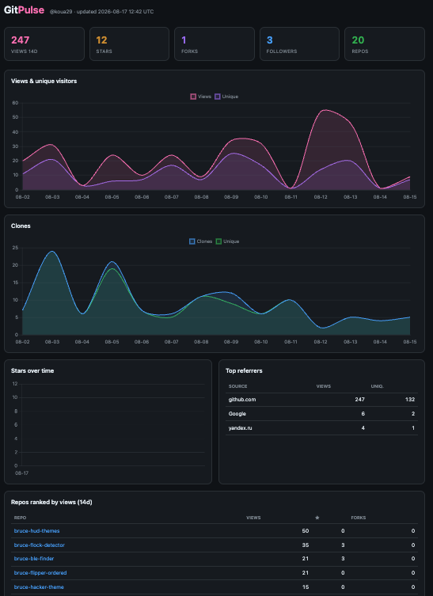
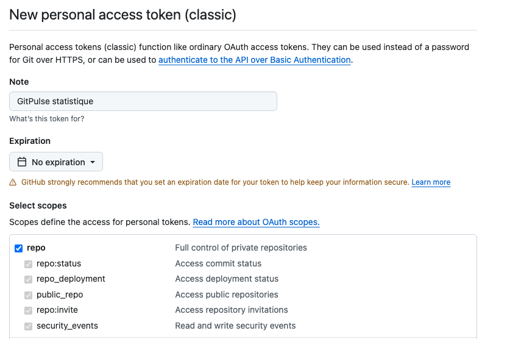

# 📊 GitPulse

**Self-hosted GitHub stats — because GitHub only keeps traffic for 14 days and has no account-wide dashboard.**

A GitHub Action runs once a day, pulls views / unique visitors / clones / referrers / stars / forks / followers for **every public repo you own**, and **merges them into history files committed back to the repo** — so your data outlives the 14-day window. A static **GitHub Pages** dashboard charts it all.

> ⚡ **Zero servers, zero cost, runs even when your computer is off.** Everything lives on GitHub: the schedule (Actions), the storage (git), and the dashboard (Pages).



🔗 **Live demo:** [koua29.github.io/gitpulse](https://koua29.github.io/gitpulse/)

---

## ✨ What you get

- 📈 **Unlimited history** of views / unique visitors / clones — per repo *and* aggregated across the account
- ⭐ **Stars, forks, followers** over time
- 🌍 **Top referring sites** and popular content
- 🏆 **Repos ranked** by traffic
- 🖥️ A graphical **dashboard on GitHub Pages** (Chart.js, dark theme, mobile-friendly)
- 🔖 An optional **auto-updating badge** for your profile README

## ⚙️ How it works

```
cron 06:17 UTC ─▶ GitHub Action ─▶ collect.py ─▶ merge into data/ ─▶ git commit ─▶ Pages refreshes
                                        └▶ update_profile.py ─▶ badge in <you>/<you> README
```

| File | Role |
|---|---|
| `collect.py` | The collector — Python **standard library only, no dependencies** |
| `update_profile.py` | Injects the stats badge into your profile README (optional) |
| `.github/workflows/collect.yml` | The daily schedule + auto-commit |
| `data/` | Accumulated history (JSON, versioned by git) |
| `docs/` | The GitHub Pages dashboard (static HTML + Chart.js) |

---

## 🚀 Deploy it on your own GitHub account

Nothing to install locally. The whole setup is done on github.com and takes ~5 minutes.

### 1. Get the code into your account

Click **[Use this template ▸ Create a new repository](https://github.com/koua29/gitpulse/generate)** (or **Fork**), and name it e.g. `gitpulse`.

> The workflow reads the owner from `github.repository_owner`, so **you don't need to edit a single line** — it automatically targets whoever owns the repo.

### 2. Create a Personal Access Token (PAT)

GitHub's traffic API requires **push access**, so you need a token with the `repo` scope.

Go to **[Settings ▸ Developer settings ▸ Personal access tokens ▸ Tokens (classic)](https://github.com/settings/tokens)** → **Generate new token (classic)**:

- **Note:** anything, e.g. `GitPulse`
- **Expiration:** your call (if you set one, remember to renew it, or the daily job will silently stop)
- **Scopes:** check **`repo`** — that single top-level checkbox is all you need



Click **Generate token** and **copy it** (it's shown only once).

### 3. Add the token as a repository secret

In **your** GitPulse repo → **Settings ▸ Secrets and variables ▸ Actions ▸ New repository secret**:

- **Name:** `GITPULSE_TOKEN`
- **Secret:** paste the token

Or with the [GitHub CLI](https://cli.github.com/):

```bash
gh secret set GITPULSE_TOKEN --repo YOUR-USERNAME/gitpulse
```

### 4. Enable GitHub Pages

Repo → **Settings ▸ Pages** → **Source: Deploy from a branch**, branch **`main`**, folder **`/docs`** → **Save**.

Your dashboard will be at `https://YOUR-USERNAME.github.io/gitpulse/`.

### 5. Run it once

Repo → **Actions ▸ GitPulse collect ▸ Run workflow**. That seeds the first snapshot; after that it runs automatically every day.

### 6. (Optional) Profile README badge

If you have a [profile README](https://docs.github.com/en/account-and-profile/setting-up-and-managing-your-github-profile/customizing-your-profile/managing-your-profile-readme) (a repo named exactly like your username), paste these two markers where you want the badge:

```markdown
<!--GITPULSE:START-->
<!--GITPULSE:END-->
```

Each daily run rewrites the block between them, e.g.:

> 📊 **247** views (14d) · ⭐ **12** stars · 🍴 **1** forks · 👥 **3** followers · across **20** repos

If you don't have a profile README, this step is skipped automatically — nothing to do.

---

## 🔒 Privacy

GitPulse collects **public repos only** (`visibility=public`, plus a defensive filter). Private repo names and traffic are **never** written to disk or the dashboard — safe to publish the dashboard publicly.

## 🛠️ Customize

- **Schedule:** edit the `cron:` line in `.github/workflows/collect.yml` ([crontab syntax](https://crontab.guru/), UTC).
- **Dashboard look:** it's plain HTML/CSS in `docs/index.html` — tweak colors in the `:root` block.
- **Run locally:**
  ```bash
  export GITHUB_TOKEN=ghp_xxx
  export GH_USER=YOUR-USERNAME
  python collect.py
  ```

## 📝 License

MIT — see [LICENSE](LICENSE). Made to be forked.
